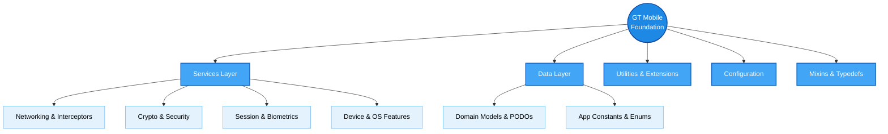

# Gotech Mobile Foundation

The `gt_mobile_foundation` package serves as the core architectural bedrock for Gotech Flutter mobile applications. It provides a standardized, well-documented, and highly reusable set of foundational primitives, services, utilities, and models. 

By abstracting common application layers—such as secure networking, session management, cryptography, file system operations, and device permissions—this package ensures consistency, accelerates development, and enforces best practices across all Gotech mobile projects.

## Architecture Overview

The foundation is strictly modularized into distinct domains, ensuring a clean separation of concerns and highly testable code:

### Core Modules

- **Services (`lib/services/`)**: The core engine of the foundation. Provides abstract interfaces and concrete implementations for HTTP networking (with Dio interceptors), AES/RSA cryptography, biometric authentication, Firebase Crashlytics/Analytics, push notifications, file system management, and device permissions.
- **Data (`lib/data/`)**: Centralized repository for structured data definitions, including immutable models, Plain Old Dart Objects (PODOs), standardized enums, and app-wide constants (e.g., regex patterns, MIME types).
- **Config (`lib/config/`)**: Contains app-level configuration structures and global string resources.
- **Extensions & Utilities (`lib/extensions/`, `lib/utilities/`)**: A rich suite of Dart extension methods (for Strings, Collections, Context, etc.) and global helper classes (like `AppLogger` and `AppHelpers`) that streamline everyday coding tasks.
- **Mixins & Typedefs (`lib/mixins/`, `lib/typedefs/`)**: Reusable behavioral traits (e.g., analytics tracking, HTTP handling) and standardized function signatures to enforce strict typing across projects.
