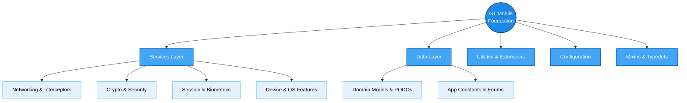

# Gotech Mobile Foundation

The `gt_mobile_foundation` package serves as the core architectural bedrock for Gotech Flutter mobile applications. It provides a standardized, well-documented, and highly reusable set of foundational primitives, services, utilities, and models. 

By abstracting common application layers—such as secure networking, session management, cryptography, file system operations, and device permissions—this package ensures consistency, accelerates development, and enforces best practices across all Gotech mobile projects.

## Architecture Overview

The foundation is strictly modularized into distinct domains, ensuring a clean separation of concerns and highly testable code:



```mermaid
graph TD
    Core((GT Mobile<br/>Foundation))

    %% Modules
    Services[Services Layer]
    Data[Data Layer]
    Utils[Utilities & Extensions]
    Config[Configuration]
    Mixins[Mixins & Typedefs]

    Core --> Services
    Core --> Data
    Core --> Utils
    Core --> Config
    Core --> Mixins

    %% Services breakdown
    Services --> S1[Networking & Interceptors]
    Services --> S2[Crypto & Security]
    Services --> S3[Session & Biometrics]
    Services --> S4[Device & OS Features]

    %% Data breakdown
    Data --> D1[Domain Models & PODOs]
    Data --> D2[App Constants & Enums]

    %% Styling
    classDef main fill:#1E88E5,stroke:#0D47A1,stroke-width:2px,color:#fff;
    classDef module fill:#42A5F5,stroke:#1565C0,stroke-width:2px,color:#fff;
    classDef detail fill:#E3F2FD,stroke:#64B5F6,stroke-width:1px,color:#000;
    
    class Core main;
    class Services,Data,Utils,Config,Mixins module;
    class S1,S2,S3,S4,D1,D2 detail;
```

### Core Modules

- **Services (`lib/services/`)**: The core engine of the foundation. Provides abstract interfaces and concrete implementations for HTTP networking (with Dio interceptors), AES/RSA cryptography, biometric authentication, Firebase Crashlytics/Analytics, push notifications, file system management, and device permissions.
- **Data (`lib/data/`)**: Centralized repository for structured data definitions, including immutable models, Plain Old Dart Objects (PODOs), standardized enums, and app-wide constants (e.g., regex patterns, MIME types).
- **Config (`lib/config/`)**: Contains app-level configuration structures and global string resources.
- **Extensions & Utilities (`lib/extensions/`, `lib/utilities/`)**: A rich suite of Dart extension methods (for Strings, Collections, Context, etc.) and global helper classes (like `AppLogger` and `AppHelpers`) that streamline everyday coding tasks.
- **Mixins & Typedefs (`lib/mixins/`, `lib/typedefs/`)**: Reusable behavioral traits (e.g., analytics tracking, HTTP handling) and standardized function signatures to enforce strict typing across projects.


### RSA Public Key Providers

The crypto layer now supports reusable RSA public-key path providers:

- `RemoteRsaPublicKeyPathProvider`: downloads a PEM file with the existing HTTP service and caches it on disk.
- `LocalRsaPublicKeyPathProvider`: copies a bundled asset PEM into a readable cache directory.
- `TestRsaPublicKeyPathProvider`: returns an injected path for unit tests.

Each provider returns a device file-system path that can be passed into the crypto service or injected directly into tests.

The local and remote providers require a trusted, app-private cache directory.
Custom cache filenames must contain 1-255 ASCII letters, digits, dots, underscores,
or hyphens, begin with a letter or digit, and not end with a dot. Paths and Windows
reserved device names are rejected with RsaPublicKeyPathProviderException.
Existing cache entries must be regular files; symbolic links (including dangling
links) and directories are rejected. The path is checked again after loading a key
and before writing it. Keep the cache directory and its ancestors under app control;
path checks cannot eliminate filesystem races in an attacker-writable directory.

Example registration with `GetIt`:

```dart
locator.registerLazySingleton<RsaPublicKeyPathProvider>(
  () => RemoteRsaPublicKeyPathProvider(
    httpService: locator<AppHttpService>(),
    endpoint: 'https://example.com/public_key.pem',
    directory: locator<Directory>(),
  ),
);
```

### Security review context

For the OneBank report dated 10 September 2026:

- **1642 (CWE-331):** OneBank maintainers confirm the numeric random helpers are
  never used for cryptography. Both now use `Random.secure()` as a defensive
  measure. The foundation crypto implementation does not call these helpers:
  AES keys are supplied through configuration and AES-GCM IVs use
  `IV.fromSecureRandom(12)`. The helpers' small ranges do not provide uniqueness
  guarantees and must not be used for cryptographic material or session tokens.
- **1643 (CWE-73):** The RSA cache providers validate filenames with reusable
  `AppRegex` patterns, check normalized path containment, reject symlink and
  non-file entries, and repeat validation after loading a key before writing.
  Asset and response contents do not determine cache paths. A trusted,
  app-private cache directory remains a caller requirement.
- **1644 (CWE-295):** OneBank maintainers confirm `AppHttpOverrides` was never
  used by the application. Commit `e05ee1c` removed the utility and its export.
  The report's referenced foundation revision, `8838505`, returned `false`
  from the bad-certificate callback; its old claim to bypass validation was
  inaccurate. The HTTP service does not install certificate overrides.

The usage statements above are application-maintainer confirmations. Package
source establishes the implementation measures; application call-site and build
evidence should accompany any scanner review. These notes do not suppress
findings or establish that Veracode has accepted a mitigation.
